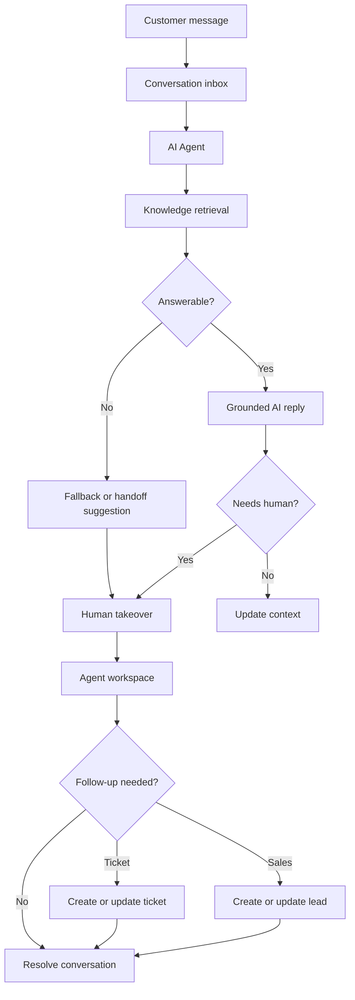

# AgentDesk

[简体中文](README_ZH.md)

AgentDesk is an AI-powered customer service desk for teams that need to answer customer questions, coordinate human support, and follow up on sales opportunities from one workspace.

It brings together website chat, messaging channels, knowledge-base answers, human handoff, tickets, sales leads, automation, and agent improvement workflows. Instead of treating AI as a standalone chatbot, AgentDesk makes it part of the daily support operation: AI handles the first response, humans keep control of exceptions, and every useful conversation can become reusable knowledge.

## Why AgentDesk

Customer support and sales conversations rarely stay in one clean place. Website visitors, WhatsApp users, Messenger contacts, tickets, internal notes, product questions, and sales follow-ups all move at different speeds.

AgentDesk is designed for teams that want to:

- Keep every customer conversation in one operational inbox.
- Let AI answer routine questions with knowledge-base grounding.
- Hand off naturally when a conversation needs a person.
- Preserve customer context, preferences, and prior buying intent.
- Turn qualified conversations into tickets or sales leads.
- Review real conversations and improve the next AI or human response.

## What You Can Do

### Answer with AI, hand off to humans

AI Agents can reply first, retrieve from bound knowledge bases, call configured tools, and ask for confirmation when the next step needs human control. When the customer asks for a person or the system cannot answer confidently, the conversation moves into the human support workflow.

### Run a shared inbox for every channel

Customer messages from web chat and messaging channels are normalized into conversations. Agents can read, reply, take over, delegate, translate, add internal context, and continue service without switching between disconnected tools.

### Convert conversations into work

Support conversations can become tickets, sales leads, follow-up tasks, or automation events. AgentDesk keeps customer context close to the actual messages, so service records and sales opportunities stay traceable to the conversation that created them.

### Improve agents from real cases

Teams can use knowledge bases, Skills, conversation memory, sales experience extraction, and review workflows to make AI responses more grounded over time. The system favors auditable evidence and human review instead of silently learning from every conversation.

## Product Tour

### Customer Chat


Customers can start a support conversation from the web chat page. The AI Agent responds first with knowledge-grounded answers, and human handoff remains available when the customer needs a person.

### Agent Workspace


The agent workspace is built for daily support work: conversation lists, message handling, AI handoff, agent replies, customer context, private collaboration, tickets, and sales follow-up all live in the same operational surface.

### Knowledge and Agent Configuration

| Knowledge Base FAQ | AI Agent Configuration |
| --- | --- |
|  |  |

Knowledge bases store FAQs, documents, and retrievable content. AI Agents can be connected to model configurations, knowledge bases, Skills, tools, and handoff policies for different service scenarios.

### Model Provider Configuration


OpenAI-compatible model providers can be configured for chat, embeddings, and reranking. Teams can control model status, context limits, output settings, timeouts, retries, and provider credentials from the dashboard.

## Core Capabilities

- **AI-first support**: AI replies first with retrieval grounding, fallback behavior, tool calling, confirmation, and human handoff.
- **Unified conversation inbox**: Web, WhatsApp, Messenger, Telegram, Zalo, WeCom, and other channel integrations share the same support workflow.
- **Human support workspace**: Agents can take over, reply, delegate, translate, collaborate privately, link customers, and close conversations.
- **Knowledge-base RAG**: Documents, FAQs, chunking strategies, vector retrieval, reranking, retrieval logs, and answerability controls.
- **Customer memory**: Conversation-derived customer facts, preferences, buying intent, and source-message evidence for later service.
- **Sales lead follow-up**: Lead extraction, source validation, owner assignment, next action tracking, reminders, and status flow.
- **Sales experience workbench**: Review historical sales conversations and distill reusable negotiation or closing Skills.
- **Business automation**: Trigger actions such as lead extraction, ticket creation, lead tagging, and owner assignment from message or lead events.
- **Cross-language service**: Translate messages and outgoing drafts while keeping customer language context separate from internal UI language.
- **Self-hosted deployment**: Run with SQLite, MySQL, or PostgreSQL, and choose Qdrant, LanceDB, or Elasticsearch for vector search.

## How It Works



## Quick Start

The fastest way to try the full stack is Docker Compose:

```bash
docker compose up -d --build
```

Compose starts:

- `agent-desk`: application service on port `8083`
- `mysql`: MySQL 8.4
- `qdrant`: vector database on ports `6333` and `6334`

Open:

- Admin dashboard: `http://localhost:8083/dashboard`
- Agent workspace: `http://localhost:8083/dashboard/conversations`
- Customer demo: `http://localhost:8083/support/demo`
- Customer chat: `http://localhost:8083/support/chat`

Default administrator account:

- Username: `admin`
- Password: `ChangeMe123!`

Change the default password and configure independent auth, session, model, and channel secrets before using the system in a public or team environment.

## Local Development

Requirements:

- Go `1.26+`
- Node.js `20+`
- `pnpm`
- Qdrant

Prepare configuration:

```bash
cp config/config.example.yaml config/config.yaml
```

The default local configuration uses:

- SQLite: `data/app.db`
- Backend: `http://127.0.0.1:8083`
- Qdrant gRPC: `127.0.0.1:6334`

Start Qdrant if it is not already running:

```bash
docker run -p 6333:6333 -p 6334:6334 qdrant/qdrant
```

Install frontend dependencies:

```bash
cd web
pnpm install
cd ..
```

Start backend and frontend development servers:

```bash
task dev
```

Development URLs:

- Admin dashboard: `http://localhost:3000/dashboard`
- Agent workspace: `http://localhost:3000/dashboard/conversations`
- Customer demo: `http://localhost:3000/support/demo`
- Customer chat: `http://localhost:3000/support/chat`

## Architecture

AgentDesk is a modular monolith. The backend owns business rules, persistence, channel integration, AI runtime, and background jobs. The frontend provides the dashboard, agent workspace, customer-facing pages, embedded SDK, and workflow editing experience.

```text
.
├── cmd/                    # server, migration, generator, testdata
├── internal/
│   ├── ai/                 # LLM, RAG, runtime, Skills, MCP
│   ├── bootstrap/          # startup, routes, database, migration setup
│   ├── builders/           # model and aggregate mapping to response DTOs
│   ├── handlers/           # dashboard, api, third-party HTTP handlers
│   ├── migration/          # idempotent data migrations
│   ├── models/             # GORM models
│   ├── pkg/                # config, dto, enums, httpx, utils
│   ├── repositories/       # data access layer
│   └── services/           # business orchestration and transactions
├── flowgram-editor/        # embedded workflow editor
├── web/                    # Next.js frontend
│   ├── app/                # dashboard, workspace, support pages
│   ├── components/         # React components
│   ├── lib/                # API clients, SDK, domain utilities
│   └── public/sdk/         # embeddable SDK build output
├── config/                 # configuration files
├── docker/                 # Docker configuration
└── docs/                   # documentation site submodule
```

## Tech Stack

- Backend: Go, Gin, GORM, `github.com/mlogclub/simple`
- Frontend: Next.js 16, React 19, TypeScript, Tailwind CSS
- Databases: SQLite, MySQL, PostgreSQL
- Vector search: Qdrant, LanceDB, Elasticsearch
- AI runtime: OpenAI-compatible chat, embedding, rerank, RAG, Skills, MCP
- Workflow editor: Flowgram Editor
- Deployment: Docker, Docker Compose, GitHub Actions

## Common Commands

```bash
task dev              # start backend and frontend development servers
task build            # build the frontend SPA and current-platform Go binary
task build:lancedb    # build with LanceDB support for the current platform
task release          # build linux / darwin / windows release binaries
task release:lancedb  # build multi-platform release binaries with LanceDB
task generator        # run backend code generation
task enums            # generate frontend enums
task --list           # show all tasks
```

## More Documentation

- [AI Customer Service Configuration](AI-CUSTOMER-SERVICE.md)
- [Business Automation](AUTOMATION.md)
- [Conversation Delegation](DELEGATION.md)
- [Sales Experience Workbench](SALES-EXPERIENCE.md)
- [WhatsApp Reuse and Integration](WHATSAPP-REUSE.md)

## Docker Image

If you only need to build the application image, prepare MySQL and Qdrant yourself and mount a configuration file:

```bash
docker build -t mlogclub/agent-desk .
docker run --rm -p 8083:8083 \
  -v $(pwd)/docker/agent-desk.yaml:/app/config/config.yaml:ro \
  -v agent-desk-data:/app/data \
  mlogclub/agent-desk
```

Compose uses [docker/agent-desk.yaml](docker/agent-desk.yaml) as the in-container configuration. The application reaches `mysql` and `qdrant` through Docker service names.

## License

AgentDesk is released under the Apache License 2.0. See [LICENSE](LICENSE).
