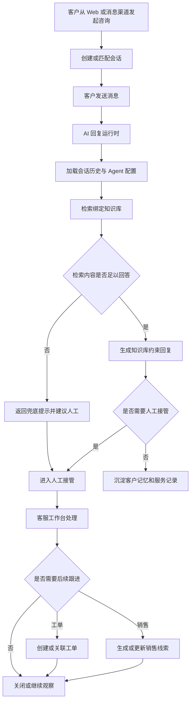

# AgentDesk

[简体中文](README_ZH.md)

AgentDesk 是一个面向客服与销售团队的 AI Agent 服务台系统，支持在线咨询、知识库问答、人工接管、销售线索跟进、工单闭环和私有化部署。

它不是简单地把大模型接入聊天框，而是围绕真实客服流程设计的一套 AI Helpdesk 基础系统：客户可以从网站或消息渠道发起咨询，AI Agent 先进行知识库约束下的接待，必要时转给人工客服，并继续沉淀客户信息、销售机会和服务记录。

## 产品预览

### 客户侧在线咨询


客户可以在 Web 聊天页中直接发起咨询。AI Agent 会先接待，基于知识库回答问题；当用户明确要求人工介入或当前问题需要人工确认时，会触发人工接管流程。

### 客服工作台


客服工作台支持会话列表、消息处理、AI 转人工、客服回复、内部协作、客户资料、会话标签和工单信息查看，适合日常客服接待和售后处理。

### 知识库与 AI Agent 配置

| 知识库 FAQ | AI Agent 配置 |
| --- | --- |
|  |  |

知识库用于沉淀 FAQ、文档和可检索内容；AI Agent 可以绑定模型配置、知识库、Skills 和工具能力，形成面向具体客服场景的智能客服实例。

### 模型配置


模型配置支持 OpenAI-compatible 接入方式，可分别配置大语言模型、向量模型和重排模型，并管理上下文、输出、超时、重试和启用状态。

## 核心能力

- **AI Agent 客服**：AI 优先回复，支持知识库约束回答、兜底、确认、工具调用和人工协同。
- **统一会话系统**：支持访客会话、消息收发、未读状态、会话分配、转接、关闭和历史消息导入。
- **多渠道接入**：支持 Web 入口，并扩展 WhatsApp、Messenger、Telegram、Zalo、企业微信等消息渠道。
- **客服工作台**：客服可接管会话、回复用户、协作处理、关联客户、创建工单和跟进销售机会。
- **知识库 RAG**：支持知识库、文档、FAQ、切片、向量检索、重排、检索日志和可回答性判断。
- **客户记忆与画像**：从会话中沉淀客户偏好、需求、历史询盘和可追溯来源，为后续接待提供上下文。
- **销售线索管理**：识别购买意图，提取产品、数量、预算、周期、联系人等信息，并支持负责人和跟进记录。
- **销售经验沉淀**：从历史销售会话中提炼可复用的谈判、决策和转化经验，形成可审阅的 Skill 规则。
- **业务自动化**：通过规则配置触发线索提取、工单创建、负责人分配和标签更新等动作。
- **跨语言接待**：支持消息翻译、回复草稿翻译和客户语言上下文识别。
- **私有化部署**：支持 SQLite / MySQL / PostgreSQL、Qdrant / LanceDB / Elasticsearch，适合本地体验、内网部署和企业自托管。

## 适用场景

- 官网在线客服
- SaaS 产品支持
- AI + 人工混合接待
- 企业内部服务台
- 售后、报障、投诉和运营支持
- 外贸、跨境和多语言销售接待
- 需要沉淀销售经验和客户画像的客服团队

## 快速开始

推荐先用 Docker Compose 体验完整服务：

```bash
docker compose up -d --build
```

Compose 会启动：

- `agent-desk`：应用服务，默认端口 `8083`
- `mysql`：MySQL 8.4
- `qdrant`：向量数据库，默认端口 `6333` / `6334`

启动后访问：

- 管理后台：`http://localhost:8083/dashboard`
- 客服会话工作台：`http://localhost:8083/dashboard/conversations`
- 客户侧演示页：`http://localhost:8083/support/demo`
- 客户聊天页：`http://localhost:8083/support/chat`

默认管理员账号：

- 用户名：`admin`
- 密码：`ChangeMe123!`

生产或公网环境中请务必修改默认密码，并配置独立的鉴权、会话、模型和渠道密钥。

## 本地开发

### 环境要求

- Go `1.26+`
- Node.js `20+`
- `pnpm`
- Qdrant

### 准备配置

```bash
cp config/config.example.yaml config/config.yaml
```

默认配置使用：

- SQLite：`data/app.db`
- 后端：`http://127.0.0.1:8083`
- Qdrant gRPC：`127.0.0.1:6334`

如果本地没有 Qdrant，可以用 Docker 启动：

```bash
docker run -p 6333:6333 -p 6334:6334 qdrant/qdrant
```

安装前端依赖：

```bash
cd web
pnpm install
cd ..
```

启动后端和前端开发服务：

```bash
task dev
```

默认开发访问地址：

- 管理后台：`http://localhost:3000/dashboard`
- 客服会话工作台：`http://localhost:3000/dashboard/conversations`
- 客户侧演示页：`http://localhost:3000/support/demo`
- 客户聊天页：`http://localhost:3000/support/chat`

## 技术栈

- 后端：Go + Gin + GORM + `github.com/mlogclub/simple`
- 前端：Next.js 16 + React 19 + TypeScript + Tailwind CSS
- 数据库：SQLite / MySQL / PostgreSQL
- 向量库：Qdrant / LanceDB / Elasticsearch
- AI：OpenAI-compatible LLM / Embedding / Rerank + RAG + Skills + MCP
- 工作流编辑器：Flowgram Editor
- 部署：Docker / Docker Compose / GitHub Actions

## 项目结构

```text
.
├── cmd/                    # server / migration / generator / testdata
├── internal/
│   ├── ai/                 # LLM / RAG / Runtime / Skills / MCP
│   ├── bootstrap/          # 启动、路由、数据库和迁移初始化
│   ├── builders/           # 模型和聚合结果到响应 DTO 的转换
│   ├── handlers/           # dashboard / api / third HTTP handlers
│   ├── middleware/         # Gin middleware
│   ├── migration/          # 幂等数据迁移
│   ├── models/             # GORM models
│   ├── pkg/                # config / dto / enums / httpx / utils 等共享包
│   ├── repositories/       # 数据访问层
│   └── services/           # 业务编排和事务边界
├── flowgram-editor/        # 嵌入式工作流编辑器
├── web/                    # Next.js 前端项目
│   ├── app/                # 管理后台、客服工作台和客户侧页面
│   ├── components/         # React components
│   ├── lib/                # API client、SDK 和业务工具
│   └── public/sdk/         # 可嵌入 SDK 构建产物
├── config/                 # 配置文件
├── docker/                 # Docker 配置
└── docs/                   # 文档站点子模块
```

## 常用命令

```bash
task dev              # 启动后端和前端开发服务
task build            # 构建前端 SPA 和当前平台 Go 二进制
task build:lancedb    # 构建启用 LanceDB 的当前平台二进制
task release          # 构建 linux / darwin / windows 发布产物
task release:lancedb  # 构建启用 LanceDB 的多平台发布产物
task generator        # 运行后端代码生成
task enums            # 生成前端枚举
task --list           # 查看全部任务
```

## 业务流程



## 相关文档

- [AI 客服配置](AI-CUSTOMER-SERVICE.md)
- [业务自动化](AUTOMATION.md)
- [会话委派](DELEGATION.md)
- [销售经验工作台](SALES-EXPERIENCE.md)
- [WhatsApp 复用与集成](WHATSAPP-REUSE.md)

## Docker 镜像

如果只需要构建应用镜像，可以自行准备 MySQL 和 Qdrant，并挂载配置文件：

```bash
docker build -t mlogclub/agent-desk .
docker run --rm -p 8083:8083 \
  -v $(pwd)/docker/agent-desk.yaml:/app/config/config.yaml:ro \
  -v agent-desk-data:/app/data \
  mlogclub/agent-desk
```

Compose 使用 [docker/agent-desk.yaml](docker/agent-desk.yaml) 作为容器内配置，应用会通过 Docker 内部服务名访问 `mysql` 和 `qdrant`。

## License

本项目使用 Apache License 2.0，见 [LICENSE](LICENSE)。
