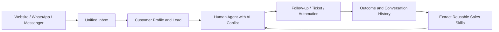

# AgentDesk

English | [简体中文](README_ZH.md)

AgentDesk is an open-source, self-hosted customer reception and sales-assistance workspace for teams that sell and support through conversations.

It brings website chat, WhatsApp, Messenger, human agents, AI employees, customer profiles, sales leads, follow-up work, automation, and reusable sales Skills into one operating loop. Instead of treating AI as a standalone chatbot, AgentDesk makes it part of the service workflow: AI can answer first, assist privately, hand off safely, and turn useful conversations into reusable knowledge.

Customer-facing teams can use AgentDesk to keep every inquiry in one inbox, respond with grounded AI assistance, preserve customer context, and move qualified conversations into follow-up, ticket, or sales workflows without losing the original message evidence.

This repository started from [huabeitech/agent-desk](https://github.com/huabeitech/agent-desk) and is being developed into a multichannel AI sales and service platform. See [Upstream and License](#upstream-and-license) for attribution.

## Product Direction



The AI layer is not limited to automatic replies. It can work privately beside a salesperson, retrieve approved knowledge, recommend a reply, explain which Skills and sources were used, and learn reusable sales techniques from selected conversation histories after human review.

## Capabilities Added in This Fork

The upstream project provides the base helpdesk, knowledge-base, ticket, and Agent runtime. The following product capabilities are the focus of this fork and are implemented or substantially extended in this repository.

### 1. Unified Website, WhatsApp, and Messenger Reception

- Added independent channel-management entries for website chat, WhatsApp, and Messenger while normalizing inbound data into the same customer, conversation, and message model.
- Extended the inbox from web support into a multichannel workbench with channel filters, unread state, claim, owner assignment, transfer, close, and customer-context synchronization.
- Added a shared linked-message contract and renderer for text, images, audio, video, documents, stickers, reactions, quoted replies, edits, recalls, contacts, locations, calls, polls, and protocol-specific fallback types.
- Added WhatsApp linked-device QR login, session restoration, profile/avatar synchronization, attachment download and upload, message decryption, history synchronization, missing-history recovery, idempotent persistence, and outbound-media support.
- Added Messenger protocol integration through a separate connector while keeping channel transport concerns outside the sales and AI domain services.

> WhatsApp currently uses the open-source `whatsmeow` linked-device protocol, not Meta Cloud API. Messenger relies on a protocol adapter rather than the official business inbox API. Production use requires an independent review of platform terms, account risk, customer authorization, and data compliance.

### 2. AI Sales Copilot and Shadow Mode

- Added private suggested replies beside the live conversation. Closing and reopening the panel does not inherently regenerate a reply; a changed conversation context or an explicit retry controls regeneration.
- Added traceable suggestion metadata: mounted Skills, tool execution state, knowledge retrieval status, cited chunks, selected AI employee/model, latency, and failure reason.
- Added language detection, source/target translation, response-language enforcement, and cross-language display so an international-sales team can read locally while replying in the customer's language.
- Added AI employee configuration for identity, goal, system prompt, model, knowledge bases, Skills, MCP tools, workflows, fallback/handoff strategy, context size, and reception mode.
- Added draft preview, shadow comparison, and time-bounded AI delegation trials. Trial output is private and cannot become a customer message without passing the explicit delivery path.
- Separated channel receiving, manual sending, AI assistance, and automatic reception into independent states so connecting a real account does not implicitly enable automatic replies.

### 3. Inquiry-to-Sales Follow-up Loop

- Added lead extraction from real conversation context, including contact details, company, country/region, products, quantity, budget, purchase timing, intent, and evidence sources.
- Added AI-generated tags and lead enrichment without replacing manual remarks, manual tags, or salesperson ownership.
- Added lead stages, owner assignment, follow-up records, next-action scheduling, due reminders, won/lost outcomes, and links back to the source conversation.
- Added customer profile synchronization for channel display name and avatar, plus manual contact remarks and tags for information that should not be overwritten by a later sync.
- Connected conversations, leads, customers, tickets, notifications, and follow-up history so an inquiry remains actionable after the chat ends.

### 4. Sales Experience Mining and Skill Lifecycle

- Added a dedicated workbench that imports a complete customer lifecycle or a user-selected subset of messages as an immutable review case.
- Added evidence-first extraction that is intentionally allowed to return no result. The miner distinguishes reusable sales techniques from routine inquiry handling, product facts, one-off transactions, and unsupported model inference.
- Added readable extraction reasons, exact source quotations, transfer tests, safety boundaries, and human review instead of exposing raw model JSON as the product interface.
- Added per-candidate editing, rejection, cancellation, retry, and independent approval. Candidates are not bulk-published simply because they came from the same extraction run.
- Added Skill-library import, AI-employee binding, and single-Skill comparison so an operator can test exactly one technique mounted versus unmounted.
- Kept source adapters decoupled through a normalized conversation format, allowing future WeCom, Feishu, or imported chat histories to enter the same extraction pipeline.

### 5. Automation, Collaboration, and Operational Controls

- Added an automation rule model with triggers, conditions, ordered actions, enable/disable state, idempotent execution scope, and run history.
- Initial actions cover lead creation and updates, customer tagging, owner assignment, follow-up work, and after-sales ticket creation; rules are disabled by default until reviewed.
- Added AI delegation ownership and revision checks, human reclaim, expiry, stale-result rejection, and private event history for controlled temporary reception.
- Added realtime inbox updates, internal notifications, conversation memory, translation state, ticket progress, and customer/lead context panels.
- Added channel-level outbound checks and human-only reception paths so operators can continue receiving and developing against production channels without automatically dispatching model output.

## Main Workspaces

| Workspace | Route | Purpose |
| --- | --- | --- |
| Unified inbox | `/dashboard/conversations` | Receive, assign, reply, inspect customers, and use AI assistance |
| Channel access | `/dashboard/channels` | Configure website, WhatsApp, and Messenger connections |
| AI employees | `/dashboard/ai-agents` | Configure identity, models, knowledge, Skills, tools, and reception |
| Sales leads | `/dashboard/sales-leads` | Qualify, assign, follow up, and close inquiries |
| Sales experience | `/dashboard/sales-experience` | Import cases, extract techniques, review Skills, and compare behavior |
| Automation | `/dashboard/automation` | Define rules and inspect execution history |
| Tickets | `/dashboard/tickets` | Track service and follow-up work to completion |
| Knowledge bases | `/dashboard/knowledge` | Maintain grounded product and service knowledge |

## Quick Start

### Docker Compose

```bash
docker compose up -d --build
```

This starts AgentDesk on port `8083`, MySQL 8.4, and Qdrant on ports `6333` and `6334`. Open `http://localhost:8083/dashboard` after the services become healthy.

The development image contains a bootstrap administrator account:

- Username: `admin`
- Password: `ChangeMe123!`

Change the password and all application, session, database, and model credentials before exposing the service to a network or connecting a production channel.

### Local Development

Requirements: Go `1.26+`, Node.js `20+`, `pnpm`, [Task](https://taskfile.dev/), and Qdrant.

```bash
cp config/config.example.yaml config/config.yaml
cd web && pnpm install && cd ..
docker run --rm -p 6333:6333 -p 6334:6334 qdrant/qdrant
task dev
```

Default development URLs:

- Frontend: `http://localhost:3000/dashboard`
- Backend: `http://127.0.0.1:8083`
- Unified inbox: `http://localhost:3000/dashboard/conversations`
- Website chat demo: `http://localhost:3000/support/demo`

`task dev` downloads the native LanceDB artifact for the current platform when required. Run `task --list` to see all available commands.

## Configuration Notes

- Runtime configuration is read from `config/config.yaml`; the file is intentionally ignored by Git.
- Model credentials belong in the dashboard or private runtime configuration and must never be committed.
- SQLite is suitable for local trials. The Compose setup uses MySQL and Qdrant.
- Connecting a channel and enabling automatic AI reception are separate decisions. Review reception mode and sending policy before using a real account.
- Imported histories and production customer data stay in local runtime data paths and are excluded from this repository.

## Technical Architecture

AgentDesk is a modular monolith: channel adapters, reception, sales workflows, AI runtime, and the dashboard are deployed together, but their contracts and ownership boundaries remain separate.

### Backend and Domain Layer

- **Language and HTTP:** Go 1.26, Gin 1.12, request validation with `validator`, localized API messages, and explicit dashboard/public API handlers.
- **Persistence:** GORM 1.31 with SQLite for local work and MySQL/PostgreSQL drivers for deployed environments. Domain models, repositories, services, handlers, and response builders form separate layers.
- **Business orchestration:** transaction-scoped services own conversations, assignments, customers, leads, follow-ups, tickets, automation, AI delegation, notifications, and audit records.
- **Authentication and safety:** JWT, OIDC/OAuth2 support, permission-scoped routes, HTML sanitization through Bluemonday, private runtime configuration boundaries, and outbound eligibility checks at both orchestration and transport stages.
- **Background work:** `robfig/cron`, an internal event bus, bounded goroutine pools via `ants`, database-backed idempotency/outbox records, and retry/revision guards for asynchronous work.

### AI and Retrieval Runtime

- **Model access:** OpenAI-compatible providers through `openai-go` and CloudWeGo Eino adapters; model, embedding, rerank, timeout, retry, and output settings are stored as runtime configuration rather than source constants.
- **Agent loop:** a transport-neutral runtime supports streaming model output, bounded multi-step tool calls, typed tool definitions, cancellation, traces, confirmation gates, and stale-context rejection.
- **Knowledge RAG:** document/FAQ ingestion, chunking, embedding, vector retrieval, reranking, source attribution, answerability checks, and fallback/handoff behavior.
- **Vector stores:** Qdrant through its gRPC client; optional embedded LanceDB through a build tag and native library.
- **Extensibility:** Skill documents, MCP servers through the official Go SDK, built-in tools, graph nodes, and a validated workflow DSL/registry.
- **Sales Skill mining:** asynchronous full-lifecycle extraction jobs, evidence audit, human review, normalized Skill output, Skill-library import, and mounted/unmounted evaluation.

### Channel and Realtime Layer

- **Website:** embedded support SDK and customer chat surfaces backed by the same conversation APIs.
- **WhatsApp:** `whatsmeow` and Signal protocol dependencies for linked-device sessions, QR pairing, structured events, encrypted media, history sync, profiles, and sending.
- **Messenger:** `mautrix-meta`-based adapter with a shared linked-chat business contract.
- **Normalization:** channel payloads become common incoming/message/status/media structures before reaching customer, conversation, sales, or AI services.
- **Realtime:** Gorilla WebSocket pushes conversation, message, assignment, translation, copilot, and work-state changes to the dashboard; persistent state remains the source of truth after reconnect.

### Frontend

- **Framework:** Next.js 16, React 19, TypeScript 6, Tailwind CSS 4, shadcn/ui, and Base UI primitives.
- **State and data:** Zustand stores, authenticated API clients, server-derived conversation revisions, and realtime merge logic designed to tolerate reconnects and duplicate events.
- **Forms and validation:** React Hook Form and Zod; TanStack Table for operational lists; dnd-kit for ordered editors.
- **Content and visualization:** TipTap, Markdown/remark/rehype, Mermaid, Recharts, structured-message viewers, and resizable workbench layouts.
- **Quality:** Go unit/integration tests, Node contract tests, TypeScript checks, ESLint, and Playwright browser scripts with synthetic API fixtures for desktop/mobile and Chinese/English states.

### Deployment and Data

- **Packaging:** Taskfile-driven development/build/release commands, a statically served Next.js export embedded in the Go binary, and Docker/Docker Compose deployment.
- **Primary data:** SQLite, MySQL, or PostgreSQL through GORM; Compose currently provisions MySQL.
- **Vector data:** Qdrant by default, optional LanceDB for a local embedded vector store.
- **Files:** local storage or Aliyun OSS through the storage service boundary.
- **Configuration:** Viper/YAML plus environment overrides; secrets, channel sessions, imported histories, and customer data stay outside Git.

```text
.
├── cmd/                    # Server, migrations, generators, test data
├── internal/
│   ├── ai/                 # LLM, RAG, runtime, Skills, tools, workflows
│   ├── handlers/           # Dashboard, public API, and channel handlers
│   ├── models/             # Persistent domain models
│   ├── repositories/       # Data access
│   ├── services/           # Reception, sales, automation, and tickets
│   └── whatsapp/           # WhatsApp linked-device adapter
├── web/                    # Next.js dashboard, chat surfaces, and SDK
├── config/                 # Configuration templates
├── docker/                 # Container runtime configuration
└── docs/                   # Supporting documentation
```

## Repository Documentation

- [AI customer service and employee configuration](AI-CUSTOMER-SERVICE.md)
- [Sales experience extraction and Skill review](SALES-EXPERIENCE.md)
- [Automation rules](AUTOMATION.md)
- [AI delegation and trial reception](DELEGATION.md)
- [WhatsApp connector implementation and reuse](WHATSAPP-REUSE.md)

Some modules are still being iterated and should be validated in a test environment before production rollout.

## Verification

```bash
go test ./internal/...
cd web
pnpm typecheck
pnpm lint
```

Some scripts in `web/*.browser.mjs` require Playwright and a built `web/out` directory. Never run customer-send verification against a connected production account.

## Upstream and License

This repository is derived from [huabeitech/agent-desk](https://github.com/huabeitech/agent-desk).

The project is distributed under the [Apache License 2.0](LICENSE). Third-party components and channel libraries retain their own licenses and platform terms.
