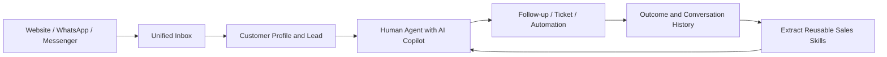

# AgentDesk

English | [简体中文](README_ZH.md)

AgentDesk is an open-source, self-hosted customer reception and sales-assistance workspace. It brings website chat, WhatsApp, Messenger, human agents, AI employees, customer profiles, sales leads, follow-up work, automation, and reusable sales Skills into one operating loop.

This repository started from [huabeitech/agent-desk](https://github.com/huabeitech/agent-desk) and is being developed into a multichannel AI sales and service platform. See [Upstream and License](#upstream-and-license) for attribution.

## Product Direction



The AI layer is not limited to automatic replies. It can work privately beside a salesperson, retrieve approved knowledge, recommend a reply, explain which Skills and sources were used, and learn reusable sales techniques from selected conversation histories after human review.

## Core Capabilities

### Unified Multichannel Reception

- One inbox for website chat, WhatsApp, Messenger, and future channel adapters.
- Customer identity, conversation history, unread state, assignment, transfer, claim, and close flows.
- Structured rendering for text, images, audio, video, documents, stickers, reactions, replies, edits, recalls, contacts, locations, and other linked-channel events.
- WhatsApp linked-device connection, QR login, contact/profile synchronization, media handling, and best-effort history synchronization.

> The current WhatsApp connector uses the open-source `whatsmeow` linked-device protocol. It is not Meta Cloud API. Production use requires an independent review of platform terms, account risk, customer authorization, and data compliance.

### AI-Assisted Reception

- AI reply suggestions remain private until an operator chooses to send them.
- Suggestions can show mounted Skills, invoked tools, knowledge retrieval state, and cited sources.
- Multilingual detection, translation, and response-language control.
- AI employee profiles with model, persona, knowledge bases, Skills, tools, handoff policy, and reception settings.
- Draft preview and shadow/trial workflows for comparing behavior without sending customer messages.

### Sales Lead and Follow-up Loop

- Convert inquiries and conversations into customer and sales-lead records.
- Enrich leads and apply AI-generated tags while retaining manual remarks and tags.
- Assign an owner, record outcomes, schedule the next action, and mark won or lost results.
- Use in-app reminders, tickets, and automation rules to keep leads from being left unattended.

### Sales Experience and Skills

- Select complete conversations or individual messages and import them as reviewable cases.
- Identify only genuinely reusable sales techniques; a conversation may correctly produce no Skill.
- Present evidence and reasoning in a readable review flow instead of exposing raw model JSON.
- Edit, reject, retry, or approve each candidate independently before adding it to the Skill library.
- Bind approved Skills to an AI employee and compare answers with and without an individual Skill.

### Knowledge, Automation, and Operations

- Knowledge-base RAG with documents, FAQs, chunks, retrieval logs, and answerability checks.
- Rules with triggers, conditions, actions, enablement state, and execution history.
- Initial actions cover lead handling, tagging, owner assignment, and ticket workflows.
- Human takeover, AI delegation trials, conversation memory, service tickets, and operational audit context.

## Main Workspaces

| Workspace | Route | Purpose |
| --- | --- | --- |
| Unified inbox | `/dashboard/conversations` | Receive, assign, reply, inspect customers, and use AI assistance |
| Channel access | `/dashboard/channels` | Configure website, WhatsApp, and Messenger connections |
| AI employees | `/dashboard/ai-agents` | Configure identity, models, knowledge, Skills, tools, and reception |
| Sales leads | `/dashboard/sales-leads` | Qualify, assign, follow up, and close inquiries |
| Sales experience | `/dashboard/sales-experience` | Import cases, extract techniques, review Skills, and compare behavior |
| Automation | `/dashboard/automation` | Define rules and inspect execution history |
| Tickets | `/dashboard/tickets` | Track service and follow-up work to completion |
| Knowledge bases | `/dashboard/knowledge` | Maintain grounded product and service knowledge |

## Quick Start

### Docker Compose

```bash
docker compose up -d --build
```

This starts AgentDesk on port `8083`, MySQL 8.4, and Qdrant on ports `6333` and `6334`. Open `http://localhost:8083/dashboard` after the services become healthy.

The development image contains a bootstrap administrator account:

- Username: `admin`
- Password: `ChangeMe123!`

Change the password and all application, session, database, and model credentials before exposing the service to a network or connecting a production channel.

### Local Development

Requirements: Go `1.26+`, Node.js `20+`, `pnpm`, [Task](https://taskfile.dev/), and Qdrant.

```bash
cp config/config.example.yaml config/config.yaml
cd web && pnpm install && cd ..
docker run --rm -p 6333:6333 -p 6334:6334 qdrant/qdrant
task dev
```

Default development URLs:

- Frontend: `http://localhost:3000/dashboard`
- Backend: `http://127.0.0.1:8083`
- Unified inbox: `http://localhost:3000/dashboard/conversations`
- Website chat demo: `http://localhost:3000/support/demo`

`task dev` downloads the native LanceDB artifact for the current platform when required. Run `task --list` to see all available commands.

## Configuration Notes

- Runtime configuration is read from `config/config.yaml`; the file is intentionally ignored by Git.
- Model credentials belong in the dashboard or private runtime configuration and must never be committed.
- SQLite is suitable for local trials. The Compose setup uses MySQL and Qdrant.
- Connecting a channel and enabling automatic AI reception are separate decisions. Review reception mode and sending policy before using a real account.
- Imported histories and production customer data stay in local runtime data paths and are excluded from this repository.

## Architecture

- Backend: Go, Gin, GORM
- Frontend: Next.js 16, React 19, shadcn/ui, Tailwind CSS
- Data: SQLite or MySQL
- Retrieval: Qdrant with optional LanceDB support
- AI: OpenAI-compatible providers, RAG, Skills, MCP, and workflow runtime
- Realtime and channels: WebSocket, website SDK, WhatsApp linked device, Messenger adapter

```text
.
├── cmd/                    # Server, migrations, generators, test data
├── internal/
│   ├── ai/                 # LLM, RAG, runtime, Skills, tools, workflows
│   ├── handlers/           # Dashboard, public API, and channel handlers
│   ├── models/             # Persistent domain models
│   ├── repositories/       # Data access
│   ├── services/           # Reception, sales, automation, and tickets
│   └── whatsapp/           # WhatsApp linked-device adapter
├── web/                    # Next.js dashboard, chat surfaces, and SDK
├── config/                 # Configuration templates
├── docker/                 # Container runtime configuration
└── docs/                   # Supporting documentation
```

## Repository Documentation

- [AI customer service and employee configuration](AI-CUSTOMER-SERVICE.md)
- [Sales experience extraction and Skill review](SALES-EXPERIENCE.md)
- [Automation rules](AUTOMATION.md)
- [AI delegation and trial reception](DELEGATION.md)
- [WhatsApp connector implementation and reuse](WHATSAPP-REUSE.md)

Some modules are still being iterated and should be validated in a test environment before production rollout.

## Verification

```bash
go test ./internal/...
cd web
pnpm typecheck
pnpm lint
```

Some scripts in `web/*.browser.mjs` require Playwright and a built `web/out` directory. Never run customer-send verification against a connected production account.

## Upstream and License

This repository is derived from [huabeitech/agent-desk](https://github.com/huabeitech/agent-desk). The multichannel sales workflows, sales-experience extraction, AI assistance, automation, and related product changes are maintained at:

- [shenzhen-unique-armor/customer-service-desk](https://gitee.com/shenzhen-unique-armor/customer-service-desk)

The project is distributed under the [Apache License 2.0](LICENSE). Third-party components and channel libraries retain their own licenses and platform terms.
