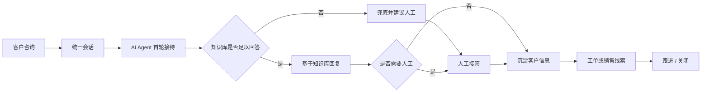

# AgentDesk Customer Service Desk

基于 AgentDesk 二次开发的 AI 客服与销售跟进系统。项目面向需要同时处理网站咨询、消息渠道接入、知识库问答、人工接管和后续销售跟进的团队，重点展示一套从“客户咨询”到“AI 接待 / 人工协作 / 线索跟进”的完整业务链路。

> 说明：本仓库保留原项目历史、许可证和已有基础能力。我的整理重点是公开展示本次二次开发方向、工程拆解和可核验的源码入口，避免把已有开源基础误表述为个人从零实现。

## 项目定位

传统客服系统通常只覆盖工单或在线聊天，本项目把 AI Agent、知识库 RAG、人工接管和销售线索沉淀放在同一条链路中：



适合用于展示以下能力：

- AI 客服系统的后端分层、会话状态和人工接管设计。
- RAG 知识库问答、检索证据和可回答性控制。
- 多渠道消息接入后的统一会话建模。
- 客户记忆、销售线索和人工修订之间的一致性处理。
- Go + Next.js 全栈工程、Docker 部署和 CI 配置。

## 本次二次开发重点

最近一次核心提交为 `173ae4e feat: integrate multichannel AI reception and sales follow-up`。该提交在既有 AgentDesk 基础上扩展了多渠道接待、客服协作、客户记忆、销售线索、跨语言接待和 RAG 能力。

### 1. 多渠道接待

新增 WhatsApp / Messenger 相关接入链路，并将消息统一归入会话系统。实现中区分历史导入消息和实时客户消息，避免同步历史记录时触发 AI 批量回复。

关键入口：

- `internal/services/whatsapp_service.go`
- `internal/services/messenger_service.go`
- `internal/whatsapp/*`
- `internal/messenger/*`
- `web/app/(dashboard)/dashboard/channels/*`

### 2. 客服待办与人工协作

将“已读”和“已处理”拆开建模，支持客服在统一收件箱中处理待办、稍后跟进、内部备注和人工接管。这样可以避免只用未读状态代表处理进度。

关键入口：

- `internal/services/conversation_work_service.go`
- `internal/services/conversation_inbox_service.go`
- `internal/services/conversation_human_dispatch_service.go`
- `web/app/(dashboard)/dashboard/conversations/_components/reception-workbar.tsx`

### 3. 客户记忆与画像

新增会话记忆提取、人工确认、来源消息追溯和异步任务修订号保护。核心目标是防止旧的 AI 提取结果覆盖新消息或人工修订后的内容。

关键入口：

- `internal/services/conversation_memory_service.go`
- `internal/repositories/conversation_memory.go`
- `internal/models/conversation_memory.go`
- `web/app/(dashboard)/dashboard/conversations/_components/conversation-memory.tsx`

### 4. 销售线索与跟进

从客户消息中识别明确购买意图，抽取产品、数量、目的地、联系方式等字段，并保留来源消息证据。人工确认后的字段与 AI 新建议分离处理，支持负责人、下一步动作和跟进时间。

关键入口：

- `internal/services/sales_lead_extraction.go`
- `internal/services/sales_lead_service.go`
- `internal/services/sales_lead_followup.go`
- `internal/models/sales_lead.go`
- `web/app/(dashboard)/dashboard/sales-leads/page.tsx`
- `web/components/sales-lead-detail.tsx`

### 5. 跨语言接待

支持客服查看消息译文、翻译回复草稿，并在发送前确认。AI 自动回复语言只从客户当前文本和近期客户语言上下文判断，避免后台语言、知识库语言或客服界面语言干扰。

关键入口：

- `internal/services/conversation_translation_service.go`
- `internal/ai/application/runtime/reply_language.go`
- `web/app/(dashboard)/dashboard/conversations/_components/conversation-translation.tsx`
- `web/app/(dashboard)/dashboard/conversations/_components/translated-reply.tsx`

### 6. RAG 与知识库增强

新增递归切片、父子切片、网站导入和 Elasticsearch 向量库适配。父子切片的思路是用较小片段匹配问题，用较大父片段提供回答上下文。

关键入口：

- `internal/ai/rag/chunk/parent_child_provider.go`
- `internal/ai/rag/chunk/recursive_provider.go`
- `internal/services/knowledge_ingestion_service.go`
- `internal/services/knowledge_website_crawler.go`
- `internal/ai/rag/vectordb/elasticsearch.go`

### 7. AI 回复调度

新增进程内回复队列，使同一会话内的 AI 回复串行执行，不同会话仍可并行处理。同时过滤历史、撤回、发送中、失败和已关闭会话中的消息，降低错误触发自动回复的风险。

关键入口：

- `internal/ai/runtime/reply_queue.go`
- `internal/ai/runtime/reply_eligibility.go`
- `internal/ai/application/runtime/eino_agent_loop.go`

## 技术栈

| 层级 | 技术 |
| --- | --- |
| 后端 | Go 1.26, Gin, GORM, SQLite / MySQL / PostgreSQL |
| 前端 | Next.js 16, React 19, TypeScript, Tailwind CSS |
| AI | OpenAI-compatible 模型接入, Eino, MCP, RAG |
| 向量库 | Qdrant, LanceDB, Elasticsearch |
| 工作流编辑器 | Flowgram Editor, React 18 |
| 部署 | Docker, Docker Compose, GitHub Actions |

## 运行方式

推荐使用 Docker Compose 体验完整服务：

```bash
docker compose up -d --build
```

启动后访问：

- 管理后台：`http://localhost:8083/dashboard`
- 客服会话工作台：`http://localhost:8083/dashboard/conversations`
- 客户侧演示页：`http://localhost:8083/support/demo`
- 客户聊天页：`http://localhost:8083/support/chat`

默认管理员账号：

- 用户名：`admin`
- 密码：`ChangeMe123!`

公开部署前请务必修改默认密码，并配置独立的鉴权、会话和模型密钥。

## 本地开发

准备配置：

```bash
cp config/config.example.yaml config/config.yaml
```

安装前端依赖：

```bash
cd web
pnpm install
cd ..
```

启动后端和前端开发服务：

```bash
task dev
```

常用命令：

```bash
task build
task generator
task enums
go test ./internal/services/... ./internal/repositories/... ./internal/pkg/...
cd web && pnpm typecheck
```

## 验证状态

仓库中包含针对本次业务扩展的测试，例如：

- `internal/services/conversation_memory_service_test.go`
- `internal/services/sales_lead_service_test.go`
- `internal/services/sales_lead_followup_test.go`
- `internal/services/conversation_translation_service_test.go`
- `internal/ai/runtime/reply_queue_test.go`
- `web/lib/sales-lead.test.mjs`
- `web/lib/reception.test.mjs`

本 README 重点整理项目与贡献边界。公开前已对提交历史做过密钥扫描，未发现真实密钥泄露；部分示例 key 和 token 为占位符。

## 贡献边界

为了便于技术负责人审阅，建议重点查看 `173ae4e` 这次提交。该提交适合从以下三个角度追问：

- 异步 AI 提取与人工修订如何避免互相覆盖。
- 历史消息导入为什么不能触发自动回复。
- 销售线索如何保留来源证据，并区分 AI 建议与人工确认。

需要明确的是，基础客服平台、部分渠道、权限体系、知识库和工单能力来自既有 AgentDesk 项目历史。本仓库当前用于展示在该基础上的扩展、整合和工程化改造。

## License

本项目遵循原仓库许可证，见 [LICENSE](LICENSE)。二次开发内容同样在该许可证约束下公开。
