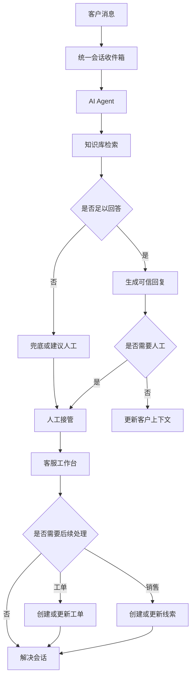

# AgentDesk

[English](README.md)

AgentDesk 是一套面向客服与销售团队的 AI Agent 服务台系统。它把网站咨询、消息渠道、知识库问答、人工接管、工单、销售线索、业务自动化和 Agent 改进流程放进同一个工作台。

它不是一个孤立的 AI 聊天框，而是一套围绕真实服务流程设计的 AI Helpdesk：AI 负责第一轮接待和知识库问答，人工客服处理例外和高价值对话，系统继续沉淀客户上下文、服务记录和销售机会。

## 为什么需要 AgentDesk

客服和销售对话很少天然整齐。客户可能来自官网、WhatsApp、Messenger 或其他消息渠道；问题可能需要知识库、人工判断、工单处理或销售跟进；有价值的信息又经常散落在历史聊天里。

AgentDesk 适合希望解决这些问题的团队：

- 把所有客户对话集中到一个可操作的收件箱。
- 让 AI 基于知识库回答常见问题，而不是自由发挥。
- 在需要人工时自然转接，不中断上下文。
- 保留客户偏好、历史需求和购买意图。
- 把高价值对话转成工单、销售线索或后续任务。
- 从真实会话中复盘经验，持续改进 AI Agent 和客服 SOP。

## 你可以用它做什么

### 用 AI 接待，用人工兜底

AI Agent 可以优先回复客户问题，检索绑定的知识库，调用配置好的工具，并在需要人工判断时要求确认或转接。当客户明确要求人工，或当前问题无法可靠回答时，会话会进入人工客服流程。

### 在统一收件箱处理多渠道消息

来自 Web 聊天和消息渠道的客户消息会被归一化为会话。客服可以阅读、回复、接管、委派、翻译、补充内部信息，并在同一工作台中继续服务客户。

### 把对话转化为实际工作

一段客户咨询可以进一步变成工单、销售线索、跟进任务或自动化事件。AgentDesk 将客户资料、上下文和来源消息保留在业务记录附近，方便追溯每一次服务和销售机会的来源。

### 从真实案例改进 Agent

团队可以通过知识库、Skills、会话记忆、销售经验提取和人工审核流程，把真实对话中的有效经验沉淀下来。系统更强调证据和审核，而不是让 AI 静默地从所有对话中学习。

## 产品导览

### 客户侧在线咨询


客户可以在 Web 聊天页中直接发起咨询。AI Agent 会先接待，基于知识库回答问题；当客户需要人工时，可以进入转人工流程。

### 客服工作台


客服工作台面向日常服务场景：会话列表、消息处理、AI 转人工、客服回复、客户上下文、内部协作、工单和销售跟进都集中在同一界面中。

### 知识库与 AI Agent 配置

| 知识库 FAQ | AI Agent 配置 |
| --- | --- |
|  |  |

知识库用于沉淀 FAQ、文档和可检索内容。AI Agent 可以绑定模型配置、知识库、Skills、工具和转人工策略，以适配不同服务场景。

### 模型供应商配置


系统支持 OpenAI-compatible 模型供应商，可配置大语言模型、向量模型和重排模型，并管理模型状态、上下文长度、输出参数、超时、重试和凭据。

## 核心能力

- **AI 优先接待**：支持知识库检索、兜底策略、工具调用、确认流程和人工接管。
- **统一会话收件箱**：Web、WhatsApp、Messenger、Telegram、Zalo、企业微信等渠道共用一套服务流程。
- **客服工作台**：支持接管、回复、委派、翻译、内部协作、客户关联和会话关闭。
- **知识库 RAG**：支持文档、FAQ、切片策略、向量检索、重排、检索日志和可回答性控制。
- **客户记忆**：沉淀客户事实、偏好、购买意图和来源消息证据，为后续服务提供上下文。
- **销售线索跟进**：支持线索提取、来源校验、负责人分配、下一步动作、提醒和状态流转。
- **销售经验工作台**：从历史销售会话中提炼可复用的谈判、决策和转化经验，形成可审核的 Skill 规则。
- **业务自动化**：根据消息或线索事件触发线索提取、工单创建、标签更新和负责人分配。
- **跨语言服务**：支持消息翻译、回复草稿翻译，并将客户语言上下文与后台界面语言隔离。
- **私有化部署**：支持 SQLite、MySQL、PostgreSQL，以及 Qdrant、LanceDB、Elasticsearch。

## 工作流程



## 快速开始

推荐使用 Docker Compose 体验完整服务：

```bash
docker compose up -d --build
```

Compose 会启动：

- `agent-desk`：应用服务，默认端口 `8083`
- `mysql`：MySQL 8.4
- `qdrant`：向量数据库，默认端口 `6333` 和 `6334`

启动后访问：

- 管理后台：`http://localhost:8083/dashboard`
- 客服会话工作台：`http://localhost:8083/dashboard/conversations`
- 客户侧演示页：`http://localhost:8083/support/demo`
- 客户聊天页：`http://localhost:8083/support/chat`

默认管理员账号：

- 用户名：`admin`
- 密码：`ChangeMe123!`

在公网或团队环境中使用前，请修改默认密码，并配置独立的鉴权、会话、模型和渠道密钥。

## 本地开发

环境要求：

- Go `1.26+`
- Node.js `20+`
- `pnpm`
- Qdrant

准备配置：

```bash
cp config/config.example.yaml config/config.yaml
```

默认本地配置使用：

- SQLite：`data/app.db`
- 后端：`http://127.0.0.1:8083`
- Qdrant gRPC：`127.0.0.1:6334`

如果本地没有 Qdrant，可以用 Docker 启动：

```bash
docker run -p 6333:6333 -p 6334:6334 qdrant/qdrant
```

安装前端依赖：

```bash
cd web
pnpm install
cd ..
```

启动后端和前端开发服务：

```bash
task dev
```

默认开发访问地址：

- 管理后台：`http://localhost:3000/dashboard`
- 客服会话工作台：`http://localhost:3000/dashboard/conversations`
- 客户侧演示页：`http://localhost:3000/support/demo`
- 客户聊天页：`http://localhost:3000/support/chat`

## 架构概览

AgentDesk 是一个模块化单体应用。后端负责业务规则、数据持久化、渠道接入、AI 运行时和后台任务；前端提供管理后台、客服工作台、客户侧页面、嵌入式 SDK 和工作流编辑体验。

```text
.
├── cmd/                    # server、migration、generator、testdata
├── internal/
│   ├── ai/                 # LLM、RAG、runtime、Skills、MCP
│   ├── bootstrap/          # 启动、路由、数据库和迁移初始化
│   ├── builders/           # 模型和聚合结果到响应 DTO 的转换
│   ├── handlers/           # dashboard、api、third HTTP handlers
│   ├── migration/          # 幂等数据迁移
│   ├── models/             # GORM models
│   ├── pkg/                # config、dto、enums、httpx、utils
│   ├── repositories/       # 数据访问层
│   └── services/           # 业务编排和事务边界
├── flowgram-editor/        # 嵌入式工作流编辑器
├── web/                    # Next.js 前端
│   ├── app/                # 管理后台、客服工作台、客户侧页面
│   ├── components/         # React components
│   ├── lib/                # API client、SDK、领域工具
│   └── public/sdk/         # 可嵌入 SDK 构建产物
├── config/                 # 配置文件
├── docker/                 # Docker 配置
└── docs/                   # 文档站点子模块
```

## 技术栈

- 后端：Go、Gin、GORM、`github.com/mlogclub/simple`
- 前端：Next.js 16、React 19、TypeScript、Tailwind CSS
- 数据库：SQLite、MySQL、PostgreSQL
- 向量检索：Qdrant、LanceDB、Elasticsearch
- AI 运行时：OpenAI-compatible Chat、Embedding、Rerank、RAG、Skills、MCP
- 工作流编辑器：Flowgram Editor
- 部署：Docker、Docker Compose、GitHub Actions

## 常用命令

```bash
task dev              # 启动后端和前端开发服务
task build            # 构建前端 SPA 和当前平台 Go 二进制
task build:lancedb    # 构建启用 LanceDB 的当前平台二进制
task release          # 构建 linux / darwin / windows 发布产物
task release:lancedb  # 构建启用 LanceDB 的多平台发布产物
task generator        # 运行后端代码生成
task enums            # 生成前端枚举
task --list           # 查看全部任务
```

## 更多文档

- [AI 客服配置](AI-CUSTOMER-SERVICE.md)
- [业务自动化](AUTOMATION.md)
- [会话委派](DELEGATION.md)
- [销售经验工作台](SALES-EXPERIENCE.md)
- [WhatsApp 复用与集成](WHATSAPP-REUSE.md)

## Docker 镜像

如果只需要构建应用镜像，可以自行准备 MySQL 和 Qdrant，并挂载配置文件：

```bash
docker build -t mlogclub/agent-desk .
docker run --rm -p 8083:8083 \
  -v $(pwd)/docker/agent-desk.yaml:/app/config/config.yaml:ro \
  -v agent-desk-data:/app/data \
  mlogclub/agent-desk
```

Compose 使用 [docker/agent-desk.yaml](docker/agent-desk.yaml) 作为容器内配置，应用会通过 Docker 内部服务名访问 `mysql` 和 `qdrant`。

## License

AgentDesk 使用 Apache License 2.0，见 [LICENSE](LICENSE)。
