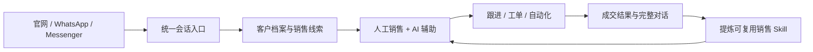

# AgentDesk

[English](README.md) | 简体中文

AgentDesk 是一套开源、可私有化部署的多渠道客户接待与销售辅助工作台，面向依赖会话完成服务和销售的团队。

它将官网咨询、WhatsApp、Messenger、人工客服、AI 员工、客户资料、销售线索、跟进任务、自动化和可复用的销售 Skill 放进同一个业务闭环。它不是孤立的 AI 聊天框，而是把 AI 放进真实服务流程里：AI 可以先接待、私下辅助、可靠转人工，并把有价值的会话沉淀成可复用知识。

客服和销售团队可以用 AgentDesk 集中处理所有询盘，用有依据的 AI 辅助提升回复质量，保留客户上下文，并把高价值对话自然推进到跟进、工单或销售流程中。

本仓库基于上游 [huabeitech/agent-desk](https://github.com/huabeitech/agent-desk) 继续开发，目标是形成面向外贸询盘和销售接待的多渠道 AI 工作平台。来源与许可证说明见[上游来源与许可证](#上游来源与许可证)。

## 产品定位



这里的 AI 不只是自动回复。它可以作为销售人员的私有副驾驶，检索经过确认的知识，生成建议回复，说明使用了哪些 Skill、工具和知识来源，并在人工审核后从选定的历史会话中沉淀可复用的销售技巧。

## 本仓库二次开发新增的核心能力

上游项目提供了基础客服、知识库、工单和 Agent 运行框架。以下能力是本仓库二次开发的重点，并已在这里新增或进行了实质性扩展。

### 1. 官网、WhatsApp、Messenger 统一接待

- 新增官网、WhatsApp、Messenger 独立渠道管理入口，同时把不同渠道的入站数据统一转换为客户、会话和消息模型。
- 将原有官网客服扩展成多渠道接待工作台，增加渠道筛选、未读状态、认领、负责人分配、转接、关闭和客户上下文同步。
- 新增统一的关联消息协议与渲染层，覆盖文本、图片、语音、视频、文件、贴纸、反应、引用回复、编辑、撤回、联系人、位置、通话、投票及协议兜底类型。
- 新增 WhatsApp 关联设备扫码、会话恢复、联系人与头像同步、附件收发、消息解密、历史同步、缺失历史恢复、幂等入库和出站媒体支持。
- 新增 Messenger 协议连接器，同时将渠道传输层与销售、AI 业务服务分开，便于继续接入新的消息来源。

> WhatsApp 当前使用开源 `whatsmeow` 关联设备协议，并非 Meta Cloud API；Messenger 也采用协议适配器，而不是官方 Business Inbox API。生产使用前需要独立评估平台条款、账号风险、客户授权和数据合规要求。

### 2. AI 销售副驾驶与影子模式

- 新增会话侧边栏私有建议回复。关闭再打开不会无条件重新生成，只有会话上下文变化或用户主动重试才触发新建议。
- 新增建议回复的可追踪信息：挂载了哪些 Skill、工具执行状态、知识库是否命中、引用了哪些片段、使用的 AI 员工与模型、耗时及失败原因。
- 新增语言识别、原文/译文展示、回复语言约束和跨语言回复，让销售可以使用本地语言阅读，同时用客户语言回复。
- 扩展 AI 员工配置，可管理身份、目标、系统提示词、模型、知识库、Skill、MCP 工具、工作流、兜底/转人工策略、上下文和接待模式。
- 新增草稿预览、影子对比和限时 AI 委派试运行；试运行结果保持私有，只有经过明确发送链路才可能成为客户消息。
- 将渠道收信、人工发信、AI 辅助和 AI 自动接待拆成独立状态，真实账号接入后不会因为“连接成功”就自动开启模型回复。

### 3. 从询盘到销售跟进的闭环

- 新增基于真实对话的线索提取，覆盖联系方式、公司、国家/地区、产品、数量、预算、采购时间、意向和对应证据来源。
- 新增 AI 标签和线索补全，同时保留人工备注、手动标签和销售负责人，不用模型输出覆盖人工判断。
- 新增线索阶段、负责人分配、跟进记录、下次跟进时间、到期提醒、成交/流失结果，并可返回原始会话核查上下文。
- 新增渠道联系人名称与头像同步，以及人工备注和标签；同步更新不会覆盖需要长期保留的人工信息。
- 打通会话、客户、线索、工单、通知和跟进历史，让询盘在聊天结束后仍然进入可执行的销售流程。

### 4. 销售经验提炼与 Skill 生命周期

- 新增独立销售经验工作台，可以按完整客户生命周期或用户选定的消息范围导入不可变的审阅案例。
- 新增“证据优先、宁缺毋滥”的提炼逻辑，允许正确地不产出结果，并区分可复用销售技巧、普通询盘、产品事实、一次性事务和模型臆测。
- 新增可读的提炼理由、原文证据、跨场景迁移测试、安全边界和人工审核，不再把原始模型 JSON 当成产品界面。
- 每个候选 Skill 可单独编辑、取消、驳回、重新提炼和确认入库，不会因为来自同一次任务就批量发布。
- 新增 Skill 库导入、AI 员工挂载和单个 Skill 对比测试，能够精确比较某项技巧挂载与不挂载时的回复差异。
- 通过统一会话中间格式与来源适配器解耦，为后续接入企微、飞书或外部聊天记录导入保留同一条提炼链路。

### 5. 自动化、协作与运行控制

- 新增自动化规则模型，包含触发条件、判断条件、有序动作、启停状态、幂等执行范围和运行记录。
- 第一阶段动作覆盖线索创建与更新、客户打标签、负责人分配、跟进任务和售后工单；规则默认关闭，审核后再启用。
- 新增 AI 委派的归属校验、版本校验、人工收回、到期结束、过期结果拒绝和私有事件记录，用于受控的临时接待。
- 新增实时会话更新、站内通知、会话记忆、翻译状态、工单进展和客户/线索上下文面板。
- 新增渠道出站检查和纯人工接待路径，使团队可以在接入真实生产渠道后继续收信与开发，而不会自动把模型结果发给客户。

## 主要工作区

| 工作区 | 路径 | 用途 |
| --- | --- | --- |
| 统一会话 | `/dashboard/conversations` | 接待、认领、分配、回复、查看客户和使用 AI 辅助 |
| 渠道接入 | `/dashboard/channels` | 配置官网、WhatsApp 和 Messenger |
| AI 员工 | `/dashboard/ai-agents` | 配置身份、模型、知识、Skill、工具和接待策略 |
| 销售线索 | `/dashboard/sales-leads` | 识别、分配、跟进并关闭询盘 |
| 销售经验 | `/dashboard/sales-experience` | 导入案例、提炼技巧、审核 Skill 和对比效果 |
| 自动化 | `/dashboard/automation` | 创建规则并检查执行记录 |
| 工单 | `/dashboard/tickets` | 跟踪售后和需要持续处理的任务 |
| 知识库 | `/dashboard/knowledge` | 维护产品与服务知识，约束 AI 回答 |

## 快速开始

### Docker Compose

```bash
docker compose up -d --build
```

Compose 会启动 AgentDesk（端口 `8083`）、MySQL 8.4 和 Qdrant（端口 `6333`、`6334`）。服务健康后访问 `http://localhost:8083/dashboard`。

开发镜像包含一个初始化管理员账号：

- 用户名：`admin`
- 密码：`ChangeMe123!`

在将服务暴露到网络或接入真实生产渠道前，必须修改默认密码，并分别配置应用、会话、数据库和模型密钥。

### 本地开发

环境要求：Go `1.26+`、Node.js `20+`、`pnpm`、[Task](https://taskfile.dev/) 和 Qdrant。

```bash
cp config/config.example.yaml config/config.yaml
cd web && pnpm install && cd ..
docker run --rm -p 6333:6333 -p 6334:6334 qdrant/qdrant
task dev
```

默认开发地址：

- 前端：`http://localhost:3000/dashboard`
- 后端：`http://127.0.0.1:8083`
- 统一会话：`http://localhost:3000/dashboard/conversations`
- 官网聊天示例：`http://localhost:3000/support/demo`

`task dev` 会在需要时下载当前平台的 LanceDB 原生依赖。使用 `task --list` 查看完整命令。

## 配置说明

- 运行配置位于 `config/config.yaml`，该文件默认不会提交到 Git。
- 模型凭据通过后台或私有运行配置维护，禁止提交到仓库。
- SQLite 适合本地验证；Docker Compose 默认使用 MySQL 和 Qdrant。
- 渠道成功连接与 AI 自动接待是两项独立配置。真实账号上线前必须检查 AI 员工的接待模式和渠道发送策略。
- 导入的聊天记录和生产客户数据保存在本地运行数据目录中，不属于代码仓库内容。

## 技术架构

AgentDesk 当前采用模块化单体架构：渠道连接、接待、销售流程、AI 运行时和管理后台统一部署，但各模块通过明确的数据契约和所有权边界解耦。

### 后端与领域层

- **语言与 HTTP：** Go 1.26、Gin 1.12、`validator` 请求校验、国际化 API 文案，以及相互分离的管理后台/开放 API Handler。
- **持久化：** GORM 1.31；本地开发使用 SQLite，部署环境可使用 MySQL 或 PostgreSQL。领域模型、Repository、Service、Handler、Response Builder 分层组织。
- **业务编排：** 事务化 Service 分别负责会话、分配、客户、线索、跟进、工单、自动化、AI 委派、通知和审计记录。
- **认证与边界：** JWT、OIDC/OAuth2、按权限注册路由、Bluemonday HTML 清洗、私有运行配置，以及业务编排层和渠道传输层的双重出站资格检查。
- **后台任务：** `robfig/cron`、内部事件总线、`ants` 有界协程池、数据库幂等/Outbox 记录，以及异步任务的重试、版本和过期结果保护。

### AI 与检索运行时

- **模型接入：** 通过 `openai-go` 和 CloudWeGo Eino 适配 OpenAI-compatible 服务；模型、Embedding、Rerank、超时、重试和输出参数均来自运行配置，而不是写死在源码中。
- **Agent Loop：** 与传输协议无关的运行时支持流式输出、有上限的多步工具调用、强类型工具定义、取消、Trace、确认门和过期上下文拒绝。
- **知识库 RAG：** 文档/FAQ 入库、切片、Embedding、向量召回、Rerank、来源引用、可回答性判断和知识不足时的兜底/转人工。
- **向量存储：** 默认通过 gRPC Client 使用 Qdrant；也可以通过构建标签和原生库启用嵌入式 LanceDB。
- **扩展机制：** Skill 文档、官方 Go SDK 接入的 MCP Server、内置工具、Graph 节点，以及经过校验的工作流 DSL 与 Registry。
- **销售 Skill 提炼：** 异步完整生命周期提炼任务、证据审计、人工审核、规范化 Skill 输出、Skill 库导入和挂载/未挂载效果评估。

### 渠道与实时通信层

- **官网渠道：** 嵌入式客服 SDK 与客户聊天页面，共用统一会话 API。
- **WhatsApp：** 基于 `whatsmeow` 和 Signal 协议依赖实现关联设备会话、二维码登录、结构化事件、加密媒体、历史同步、联系人资料和消息发送。
- **Messenger：** 基于 `mautrix-meta` 的协议适配器，并通过共享的 Linked Chat 契约进入业务层。
- **消息归一化：** 各渠道原始 Payload 先转换为统一的 Incoming、Message、Status 和 Media 结构，再交给客户、会话、销售或 AI 服务。
- **实时更新：** Gorilla WebSocket 推送会话、消息、分配、翻译、Copilot 和工作状态；断线重连后仍以数据库持久化状态为准。

### 前端

- **框架：** Next.js 16、React 19、TypeScript 6、Tailwind CSS 4、shadcn/ui 和 Base UI Primitives。
- **状态与数据：** Zustand Store、统一鉴权 API Client、服务端会话版本号和可容忍重连/重复事件的实时合并逻辑。
- **表单与校验：** React Hook Form + Zod；TanStack Table 用于业务列表；dnd-kit 用于有序配置编辑。
- **内容与可视化：** TipTap、Markdown/remark/rehype、Mermaid、Recharts、结构化消息查看器和可调整尺寸的工作台布局。
- **质量保障：** Go 单元/集成测试、Node 契约测试、TypeScript 类型检查、ESLint，以及基于合成 API Fixture 的 Playwright 中英文、桌面端和移动端浏览器验证。

### 部署与数据设施

- **构建发布：** 使用 Taskfile 统一开发、构建和发布命令；Next.js 静态产物嵌入 Go 二进制，并支持 Docker/Docker Compose 部署。
- **业务数据：** 通过 GORM 使用 SQLite、MySQL 或 PostgreSQL；当前 Compose 默认启动 MySQL。
- **向量数据：** 默认使用 Qdrant，也可构建带 LanceDB 的本地嵌入式版本。
- **文件存储：** 通过存储服务边界使用本地文件系统或阿里云 OSS。
- **配置管理：** Viper/YAML 配合环境变量覆盖；密钥、渠道会话、导入记录和客户生产数据均保留在 Git 之外。

```text
.
├── cmd/                    # 服务入口、迁移、代码生成和测试数据
├── internal/
│   ├── ai/                 # LLM、RAG、运行时、Skills、工具和工作流
│   ├── handlers/           # 管理后台、开放 API 与渠道处理器
│   ├── models/             # 持久化领域模型
│   ├── repositories/       # 数据访问层
│   ├── services/           # 接待、销售、自动化与工单业务编排
│   └── whatsapp/           # WhatsApp 关联设备协议适配
├── web/                    # Next.js 管理后台、聊天界面和 SDK
├── config/                 # 配置模板
├── docker/                 # 容器运行配置
└── docs/                   # 补充文档
```

## 仓库文档

- [AI 客服与 AI 员工配置](AI-CUSTOMER-SERVICE.md)
- [销售经验提炼与 Skill 审核](SALES-EXPERIENCE.md)
- [自动化规则](AUTOMATION.md)
- [AI 委派与试运行接待](DELEGATION.md)
- [WhatsApp 接入实现与复用说明](WHATSAPP-REUSE.md)

这些文档记录当前实现边界。部分模块仍处于持续迭代阶段，上生产前应先在测试环境完成验证。

## 验证

```bash
go test ./internal/...
cd web
pnpm typecheck
pnpm lint
```

`web/*.browser.mjs` 中的部分浏览器脚本需要 Playwright 和已构建的 `web/out`。禁止使用已连接的生产账号执行任何客户发信测试。

## 上游来源与许可证

本仓库基于 [huabeitech/agent-desk](https://github.com/huabeitech/agent-desk) 开发。当前的多渠道销售链路、销售经验提炼、AI 辅助、自动化及相关产品改动维护在：

- [shenzhen-unique-armor/customer-service-desk](https://gitee.com/shenzhen-unique-armor/customer-service-desk)

项目采用 [Apache License 2.0](LICENSE)。第三方组件和渠道协议库分别遵循各自的许可证及平台条款。
