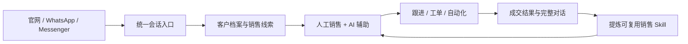

# AgentDesk

[English](README.md) | 简体中文

AgentDesk 是一套开源、可私有化部署的多渠道客户接待与销售辅助工作台。它将官网咨询、WhatsApp、Messenger、人工客服、AI 员工、客户资料、销售线索、跟进任务、自动化和可复用的销售 Skill 放进同一个业务闭环。

本仓库基于上游 [huabeitech/agent-desk](https://github.com/huabeitech/agent-desk) 继续开发，目标是形成面向外贸询盘和销售接待的多渠道 AI 工作平台。来源与许可证说明见[上游来源与许可证](#上游来源与许可证)。

## 产品定位



这里的 AI 不只是自动回复。它可以作为销售人员的私有副驾驶，检索经过确认的知识，生成建议回复，说明使用了哪些 Skill、工具和知识来源，并在人工审核后从选定的历史会话中沉淀可复用的销售技巧。

## 核心能力

### 多渠道统一接待

- 在一个工作台中处理官网咨询、WhatsApp、Messenger，并为后续渠道适配预留统一入口。
- 统一管理客户身份、完整会话、未读状态、认领、分配、转接与关闭流程。
- 展示文本、图片、语音、视频、文件、贴纸、反应、引用回复、编辑、撤回、联系人、位置等结构化消息。
- 支持 WhatsApp 关联设备扫码、联系人与头像同步、附件处理及尽力而为的历史消息同步。

> 当前 WhatsApp 接入使用开源 `whatsmeow` 关联设备协议，不是 Meta Cloud API。生产使用前需要独立评估平台条款、账号风险、客户授权和数据合规要求。

### AI 辅助接待

- AI 建议回复默认仅在客服侧可见，由操作人员确认后手动发送。
- 建议结果可展示挂载的 Skill、调用的工具、知识库检索状态和引用来源。
- 支持语言识别、翻译和回复语言控制。
- AI 员工可配置模型、人设、知识库、Skill、工具、转人工策略和接待设置。
- 提供草稿预览、影子模式和试运行流程，在不向客户发消息的情况下比较效果。

### 询盘与销售跟进闭环

- 将会话自动沉淀为客户和销售线索。
- 自动补充线索信息并生成 AI 标签，同时保留人工备注和手动标签。
- 分配负责人、记录跟进结果、安排下次跟进，并标记成交或流失。
- 通过站内提醒、工单和自动化规则减少线索遗漏。

### 销售经验与 Skill

- 选择完整会话或指定消息，导入为可审阅的聊天案例。
- 只识别真正可复用的销售技巧；没有学习价值的会话可以不产生 Skill。
- 用可读的证据和判断理由呈现提炼结果，不直接暴露模型 JSON。
- 每个候选 Skill 可以独立编辑、取消、重新提炼或确认入库。
- 将确认后的 Skill 挂载到 AI 员工，并单独对比挂载与未挂载时的回复效果。

### 知识库、自动化与协作

- 知识库支持文档、FAQ、切片、向量检索、检索日志和可回答性判断。
- 自动化规则包含触发器、条件、动作、启停状态和执行记录。
- 第一阶段动作覆盖线索处理、打标签、分配负责人和售后工单。
- 支持人工接管、AI 委派试运行、会话记忆、服务工单和操作审计上下文。

## 主要工作区

| 工作区 | 路径 | 用途 |
| --- | --- | --- |
| 统一会话 | `/dashboard/conversations` | 接待、认领、分配、回复、查看客户和使用 AI 辅助 |
| 渠道接入 | `/dashboard/channels` | 配置官网、WhatsApp 和 Messenger |
| AI 员工 | `/dashboard/ai-agents` | 配置身份、模型、知识、Skill、工具和接待策略 |
| 销售线索 | `/dashboard/sales-leads` | 识别、分配、跟进并关闭询盘 |
| 销售经验 | `/dashboard/sales-experience` | 导入案例、提炼技巧、审核 Skill 和对比效果 |
| 自动化 | `/dashboard/automation` | 创建规则并检查执行记录 |
| 工单 | `/dashboard/tickets` | 跟踪售后和需要持续处理的任务 |
| 知识库 | `/dashboard/knowledge` | 维护产品与服务知识，约束 AI 回答 |

## 快速开始

### Docker Compose

```bash
docker compose up -d --build
```

Compose 会启动 AgentDesk（端口 `8083`）、MySQL 8.4 和 Qdrant（端口 `6333`、`6334`）。服务健康后访问 `http://localhost:8083/dashboard`。

开发镜像包含一个初始化管理员账号：

- 用户名：`admin`
- 密码：`ChangeMe123!`

在将服务暴露到网络或接入真实生产渠道前，必须修改默认密码，并分别配置应用、会话、数据库和模型密钥。

### 本地开发

环境要求：Go `1.26+`、Node.js `20+`、`pnpm`、[Task](https://taskfile.dev/) 和 Qdrant。

```bash
cp config/config.example.yaml config/config.yaml
cd web && pnpm install && cd ..
docker run --rm -p 6333:6333 -p 6334:6334 qdrant/qdrant
task dev
```

默认开发地址：

- 前端：`http://localhost:3000/dashboard`
- 后端：`http://127.0.0.1:8083`
- 统一会话：`http://localhost:3000/dashboard/conversations`
- 官网聊天示例：`http://localhost:3000/support/demo`

`task dev` 会在需要时下载当前平台的 LanceDB 原生依赖。使用 `task --list` 查看完整命令。

## 配置说明

- 运行配置位于 `config/config.yaml`，该文件默认不会提交到 Git。
- 模型凭据通过后台或私有运行配置维护，禁止提交到仓库。
- SQLite 适合本地验证；Docker Compose 默认使用 MySQL 和 Qdrant。
- 渠道成功连接与 AI 自动接待是两项独立配置。真实账号上线前必须检查 AI 员工的接待模式和渠道发送策略。
- 导入的聊天记录和生产客户数据保存在本地运行数据目录中，不属于代码仓库内容。

## 技术架构

- 后端：Go、Gin、GORM
- 前端：Next.js 16、React 19、shadcn/ui、Tailwind CSS
- 数据库：SQLite 或 MySQL
- 检索：Qdrant，可选 LanceDB 支持
- AI：OpenAI-compatible 模型、RAG、Skills、MCP 和工作流运行时
- 实时与渠道：WebSocket、官网 SDK、WhatsApp 关联设备、Messenger 适配器

```text
.
├── cmd/                    # 服务入口、迁移、代码生成和测试数据
├── internal/
│   ├── ai/                 # LLM、RAG、运行时、Skills、工具和工作流
│   ├── handlers/           # 管理后台、开放 API 与渠道处理器
│   ├── models/             # 持久化领域模型
│   ├── repositories/       # 数据访问层
│   ├── services/           # 接待、销售、自动化与工单业务编排
│   └── whatsapp/           # WhatsApp 关联设备协议适配
├── web/                    # Next.js 管理后台、聊天界面和 SDK
├── config/                 # 配置模板
├── docker/                 # 容器运行配置
└── docs/                   # 补充文档
```

## 仓库文档

- [AI 客服与 AI 员工配置](AI-CUSTOMER-SERVICE.md)
- [销售经验提炼与 Skill 审核](SALES-EXPERIENCE.md)
- [自动化规则](AUTOMATION.md)
- [AI 委派与试运行接待](DELEGATION.md)
- [WhatsApp 接入实现与复用说明](WHATSAPP-REUSE.md)

这些文档记录当前实现边界。部分模块仍处于持续迭代阶段，上生产前应先在测试环境完成验证。

## 验证

```bash
go test ./internal/...
cd web
pnpm typecheck
pnpm lint
```

`web/*.browser.mjs` 中的部分浏览器脚本需要 Playwright 和已构建的 `web/out`。禁止使用已连接的生产账号执行任何客户发信测试。

## 上游来源与许可证

本仓库基于 [huabeitech/agent-desk](https://github.com/huabeitech/agent-desk) 开发。当前的多渠道销售链路、销售经验提炼、AI 辅助、自动化及相关产品改动维护在：

- [shenzhen-unique-armor/customer-service-desk](https://gitee.com/shenzhen-unique-armor/customer-service-desk)

项目采用 [Apache License 2.0](LICENSE)。第三方组件和渠道协议库分别遵循各自的许可证及平台条款。
